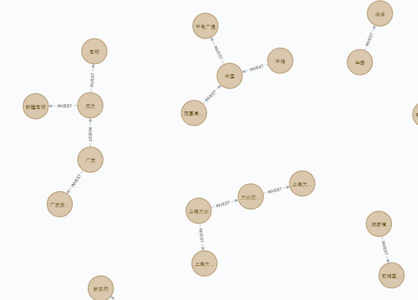

# Entity-relationship-extraction
### 概要

本项目实现在新闻中抽取某两个企业之间是否存在投资关系。

对新闻实体抽取和实体统一，得到其中的企业实体，再做句法分析和关键字提取，文本特征提取，将以上三个特征串联之后作为输入，利用随机森林训练模型，判断这两个企业是否具有投资关系。

### 依赖

- python3
- pandas
- jieba
- sklearn
- pylty
- numpy
- fool
- bayes_opt

### 实现

#### 1.数据

数据分为两部分，一部分是训练数据，一部分是待抽取实体关系的测试数据(但是不带有标签)。训练数据已标记为该新闻中的企业实体是否存在投资关系。

#### 2.实体统一

对同一实体具有多个名称的情况进行实体统一，将多个名称统一替换成一个命名实体。比如，“河北银行股份有限公司”和“河北银行”可以统一成“河北银行”。

- 分离出地名，比如河北，北京
- 去除后缀，比如有限公司，集团
- 提取经营范围，比如医疗，化学
- 剩余部分为中间字段
- 最后选择以上四个部分的某些部分进行拼接，成为一个唯一的命名实体，如果有中间字段，则仅使用中间字段即可，并对某些特殊的经营范围做补充，比如银行；否则，优先使用地名加经营范围，其次是地名加后缀。

#### 3.企业实体识别

利用foolnltk工具包，对每个新闻做命名实体识别，并对企业命名实体做实体统一，最后将每个新闻中的企业实体替换为统一的企业实体。

#### 4.特征工程

- 文本特征提取，采用tf-idf
- 关键字抽取，比如转让，收购，整合等等
- 句法特征提取，主要是与核心词之间的关系，包括企业实体本身和前后词与核心词之间的关系，距离等

#### 5.训练

将特征工程提取到的特征做onehot编码（除了tf-idf），利用随机森林进行模型拟合。使用贝叶斯超参数调优，调优参数为【决策树数量，决策树的最大深度，随机数生成器】

### 结果

```
              precision    recall  f1-score   support

           0       0.97      1.00      0.99      6150
           1       1.00      0.80      0.89       850

   micro avg       0.98      0.98      0.98      7000
   macro avg       0.99      0.90      0.94      7000
weighted avg       0.98      0.98      0.97      7000
```

可以看到在训练集上的f1-score非常高，高达97。

测试集抽取到企业投资关系的例子：

新闻：8832,山西美锦能源股份有限公司于2016年12月14日与山西亚太焦化冶镁有限公司（以下简称“亚太焦化”）签订《资产转让协议》，山西美锦能源股份有限公司以人民币13，736万元受让亚太焦化的400辆C70C型敞车，本次收购资产作价以中水资产评估有限公司出具的【2016】第4033号《资产评估报告》为准

抽取到的企业为”美锦“和”亚太“

将在测试集上预测得到的存在投资关系的企业实体保存，并利用neo4j画成知识图谱的形式可视化。



### 总结

本项目基于随机森林实现对企业投资关系的抽取，平均f1-score高达97。